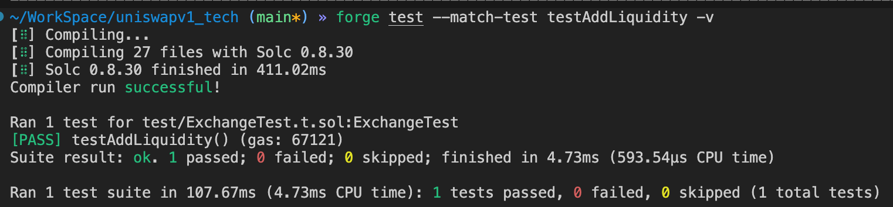

# UniswapV1 自学系列 01：Exchange 合约实现

本系列文章将通过从零开始构建 UniswapV1，深入理解去中心化交易所的核心原理和实现机制。

## 项目初始化

### 创建项目结构

首先创建项目目录并初始化 Foundry 开发环境：

```bash
$ mkdir uniswapv1_tech && cd $_
$ forge init
```

### 添加依赖库

安装 OpenZeppelin 合约库，我们将使用其标准的 ERC20 代币实现：

```bash
$ forge install openzeppelin/openzeppelin-contracts
```

### 清理默认文件

移除 Foundry 生成的示例文件，为我们的项目腾出空间：

```bash
$ rm src/Counter.sol script/Counter.s.sol test/Counter.t.sol
```

完成后的项目结构如下：

```
$ tree -a
.
├── .gitignore
├── foundry.toml
├── lib/
│   └── openzeppelin-contracts/
├── script/
├── src/
└── test/
```

### 配置 Solidity 版本

确保 `foundry.toml` 配置使用最新的 Solidity 版本：

```toml
[profile.default]
src = "src"
out = "out"
libs = ["lib"]
solc-version = "0.8.30"
```

## ERC20 代币合约

UniswapV1 专门设计用于处理 ETH 与 ERC20 代币之间的交易。因此，我们需要先创建一个标准的 ERC20 代币合约作为测试用途。

### 实现代币合约

创建 `src/Token.sol` 文件：

```solidity
// src/Token.sol
// SPDX-License-Identifier: MIT
pragma solidity ^0.8.0;

import "openzeppelin-contracts/contracts/token/ERC20/ERC20.sol";

/**
 * @title Token
 * @dev 用于测试的简单 ERC20 代币合约
 */
contract Token is ERC20 {
    /**
     * @dev 构造函数 - 创建代币并设置基本信息
     * @param name 代币名称
     * @param symbol 代币符号
     * @param initialSupply 初始供应量
     */
    constructor(
        string memory name,
        string memory symbol,
        uint256 initialSupply
    ) ERC20(name, symbol) {
        // 将所有初始供应量铸造给合约部署者
        _mint(msg.sender, initialSupply);
    }
}
```

### 代码解析

这个合约继承了 OpenZeppelin 的标准 ERC20 实现，并在构造函数中：

1. **初始化代币信息**：设置代币名称和符号
2. **铸造初始供应量**：将指定数量的代币铸造给部署者地址
3. **简化设计**：保持合约简洁，专注于核心功能

有了这个基础代币合约，我们就可以开始构建真正有趣的部分——Exchange 合约了！

## Exchange 合约架构

### UniswapV1 系统概述

UniswapV1 的核心包含两个智能合约：

1. **Factory 合约**：负责创建和管理所有交易对，维护代币地址与交易所地址的双向映射
2. **Exchange 合约**：实现具体的交易逻辑，每个 ETH-代币交易对对应一个独立的 Exchange 实例

本文专注于 Exchange 合约的实现，Factory 合约将在后续文章中详细介绍。

### Exchange 合约基础结构

创建 `src/Exchange.sol` 文件，先构建合约的基础框架：

```solidity
// src/Exchange.sol
// SPDX-License-Identifier: MIT
pragma solidity ^0.8.0;

import "@openzeppelin/contracts/token/ERC20/IERC20.sol";

/**
 * @title Exchange
 * @dev UniswapV1 交易所合约 - 处理 ETH 与单一 ERC20 代币的交易
 */
contract Exchange {
    // 与此交易所绑定的代币地址
    address public tokenAddress;

    /**
     * @dev 构造函数 - 绑定交易所与特定代币
     * @param _token 要绑定的 ERC20 代币地址
     */
    constructor(address _token) {
        // 代币地址不能为零地址
        require(_token != address(0), "invalid token address");
        tokenAddress = _token;
    }
}
```

### 设计要点说明

**代币绑定机制**：
- 每个 Exchange 实例只与一种 ERC20 代币绑定
- `tokenAddress` 设为 `public`，方便外部查询当前交易所支持的代币
- 构造函数中的零地址检查确保合约部署的有效性

**架构优势**：
- 简化了交易逻辑，每个合约专注处理一种代币
- 便于扩展，新代币只需部署新的 Exchange 实例
- 降低了单个合约的复杂度和潜在风险

## 流动性管理机制

### 流动性的重要性

在 AMM（自动做市商）模式下，交易的执行依赖于流动性池中的资产储备。用户向池中提供 ETH 和代币，使其他用户能够进行交易。

### 添加流动性函数

在 Exchange 合约中添加流动性管理功能：

```solidity
contract Exchange {
    // ... 之前的代码

    /**
     * @dev 向流动性池添加资金
     * @param _tokenAmount 要添加的代币数量
     * @notice 需要同时发送 ETH（通过 msg.value）和代币
     * @notice 调用前需要先 approve 代币给此合约
     */
    function addLiquidity(uint256 _tokenAmount) public payable {
        IERC20 token = IERC20(tokenAddress);
        token.transferFrom(msg.sender, address(this), _tokenAmount);
    }

    /**
     * @dev 获取当前代币储备量
     * @return 合约中持有的代币数量
     */
    function getReserve() public view returns (uint256) {
        return IERC20(tokenAddress).balanceOf(address(this));
    }
}
```

### 实现机制详解

**ETH 处理**：
- `payable` 修饰符允许函数接收 ETH
- 任何随函数调用发送的 ETH 都会自动增加到合约余额中
- 可通过 `address(this).balance` 查询当前 ETH 储备

**代币处理**：
- 使用 `transferFrom` 从用户地址转移代币到合约
- 要求用户事先调用代币合约的 `approve` 函数授权
- 通过 `balanceOf` 查询合约持有的代币数量

**注意事项**：
> 此版本的 `addLiquidity` 是简化实现，主要用于演示流动性添加的基本流程。完整的实现需要考虑流动性代币（LP Token）的铸造和比例计算，这将在后续章节中完善。

## 流动性功能测试

### 测试用例设计

为了验证流动性添加功能的正确性，我们需要编写相应的测试用例。创建 `test/ExchangeTest.t.sol` 文件：

```solidity
// test/ExchangeTest.t.sol
// SPDX-License-Identifier: MIT
pragma solidity ^0.8.0;

import "forge-std/Test.sol";
import "../src/Exchange.sol";
import "../src/Token.sol";

contract ExchangeTest is Test {
    Exchange exchange;
    Token token;

    // 测试账户
    address user = makeAddr("user");

    function setUp() public {
        // 部署测试代币
        token = new Token("Test Token", "TEST", 1000000 ether);
        // 部署交易所
        exchange = new Exchange(address(token));

        // 给测试用户分配代币和 ETH
        token.transfer(user, 1000 ether);
        vm.deal(user, 1000 ether);
    }

    function testAddLiquidity() public {
        vm.startPrank(user);

        // 1. 授权交易所使用用户的代币
        token.approve(address(exchange), 200 ether);

        // 2. 添加流动性：200个代币 + 100个ETH
        exchange.addLiquidity{value: 100 ether}(200 ether);

        // 3. 验证交易所余额
        assertEq(address(exchange).balance, 100 ether, "ETH 余额不正确");
        assertEq(exchange.getReserve(), 200 ether, "代币余额不正确");

        vm.stopPrank();
    }
}
```

### 测试流程解析

**测试环境准备**：
1. **setUp 函数**：部署测试合约并初始化测试环境
2. **用户账户**：使用 Foundry 的 `makeAddr` 创建测试用户
3. **资产分配**：为用户分配足够的代币和 ETH 进行测试

**测试执行步骤**：
1. **授权操作**：用户调用代币合约的 `approve` 函数，授权交易所转移其代币
2. **添加流动性**：调用 `addLiquidity` 函数，同时发送 ETH 和指定代币数量
3. **结果验证**：检查交易所合约的 ETH 和代币余额是否符合预期

**关键技术点**：
- `vm.startPrank(user)` 和 `vm.stopPrank()`：模拟特定用户的操作
- `vm.deal(user, amount)`：为测试用户分配 ETH
- `assertEq`：Foundry 提供的断言函数，用于验证测试结果

### 运行测试

在项目根目录执行以下命令运行测试：

```bash
forge test --match-test testAddLiquidity -v
```



这样我们就完成了 Exchange 合约流动性功能的基本实现和测试。在后续文章中，我们将继续完善交易功能、价格计算机制和更完整的流动性管理系统。

---

## 📚 项目仓库

完整项目代码请访问：[https://github.com/RyanWeb31110/uniswapv1_tech](https://github.com/RyanWeb31110/uniswapv1_tech)

本系列文章是基于该项目的完整教学实现，欢迎克隆代码进行实践学习！