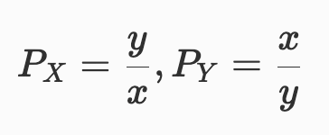
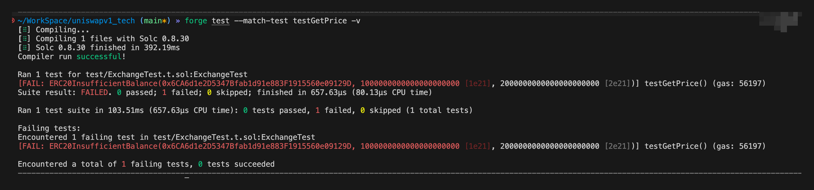
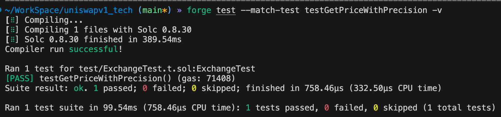
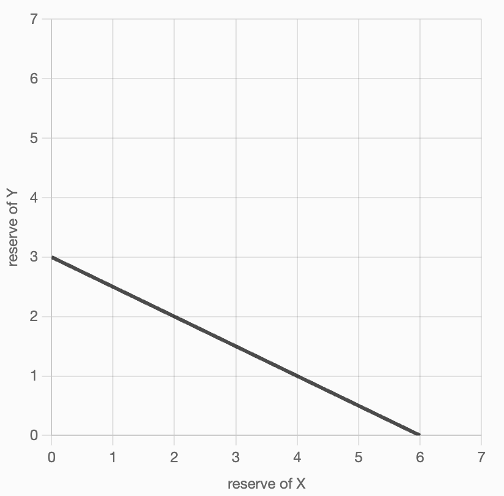
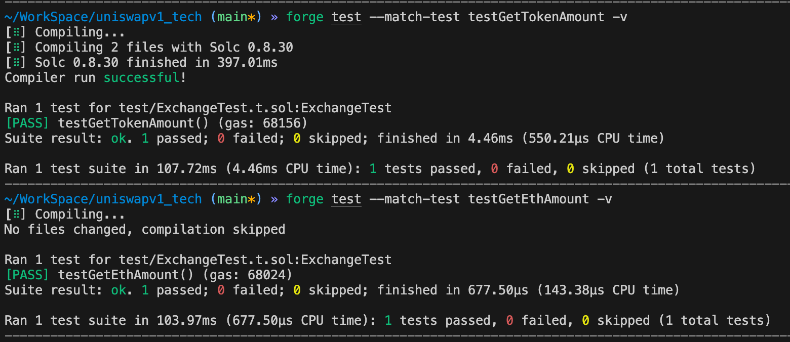
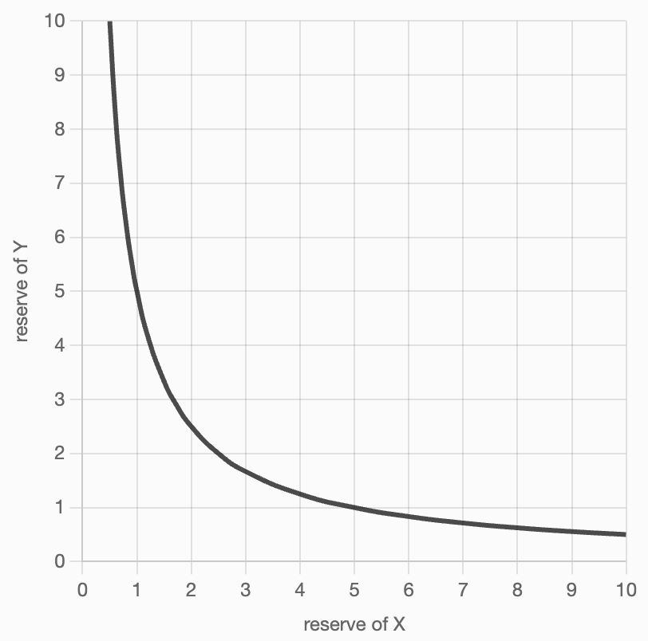
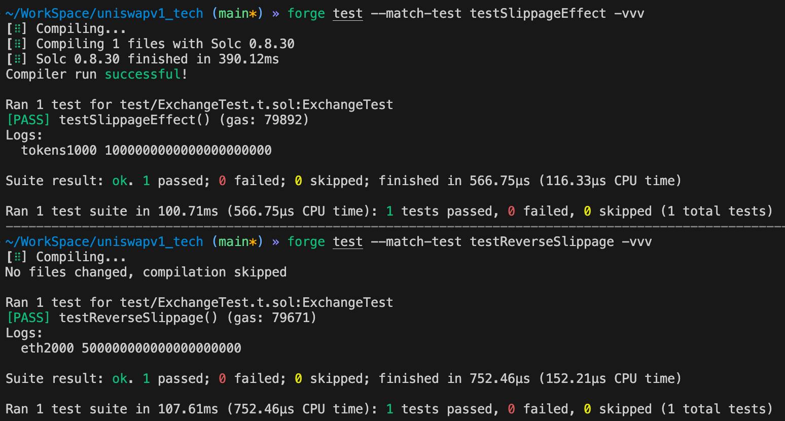

# UniswapV1 自学系列 02 - 定价功能实现

在 UniswapV1 系列的第二篇文章中，我们将深入探讨去中心化交易所的核心机制：定价功能的设计与实现。

## 定价机制的思考

### 1.1 直观的定价思路

初学者可能会认为，去中心化交易所的价格计算就是简单的储备比例关系：



其中：
- `P_X` 表示代币X相对于代币Y的价格
- `x` 和 `y` 分别表示两种代币的储备量

这种想法确实有其合理性。与中心化交易所不同，去中心化交易所合约无法获取外部价格信息，它们必须依据自身持有的资产储备来确定价格。从这个角度看，Exchange合约本身就扮演着价格预言机的角色。

### 1.2 简单定价函数的实现

让我们基于储备比例的思路，先实现一个简单的定价函数：

```solidity
/**
 * @dev 基于储备比例的简单定价函数
 * @param inputReserve 输入代币的储备量
 * @param outputReserve 输出代币的储备量
 * @return 返回价格比例
 */
function getPrice(uint256 inputReserve, uint256 outputReserve)
    public
    pure
    returns (uint256)
{
    // 确保储备量不为零，避免除零错误
    require(inputReserve > 0 && outputReserve > 0, "invalid reserves");

    // 返回输入储备与输出储备的比例
    return inputReserve / outputReserve;
}
```

### 1.3 测试简单定价函数

让我们使用 Foundry 测试框架来验证定价函数的正确性：

```solidity
// 在 ExchangeTest.t.sol 中添加测试函数
function testGetPriceSimpleImpl() public {
    vm.startPrank(user);

    // 1. 授权并添加流动性：2000个代币 + 1000个ETH
    token.approve(address(exchange), 2000 ether);
    exchange.addLiquidity{value: 1000 ether}(2000 ether);

    // 2. 获取当前储备量
    uint256 tokenReserve = exchange.getReserve();
    uint256 etherReserve = address(exchange).balance;

    // 3. 测试价格计算
    // ETH相对于Token的价格（应该是0.5）
    uint256 ethPerToken = exchange.getPrice(etherReserve, tokenReserve);
    assertEq(ethPerToken, 0); // 注意：这里会失败！

    // Token相对于ETH的价格（应该是2）
    uint256 tokenPerEth = exchange.getPrice(tokenReserve, etherReserve);
    assertEq(tokenPerEth, 2);

    vm.stopPrank();
}
```

```bash
forge test --match-test testGetPriceSimpleImpl -v
```



## 2. 整数除法精度问题

### 2.1 问题分析

按照我们的预期，存入2000个代币和1000个ETH后，代币价格应该是0.5 ETH，ETH价格应该是2个代币。但是测试却失败了，显示代币价格为0。

**根本原因：**Solidity只支持整数运算，除法运算会自动向下取整。当计算 `1000/2000 = 0.5` 时，结果被截断为0！

### 2.2 精度优化方案

为了解决精度问题，我们需要引入放大因子：

```solidity
/**
 * @dev 改进的定价函数，使用1000倍放大因子提高精度
 * @param inputReserve 输入代币的储备量
 * @param outputReserve 输出代币的储备量
 * @return 返回价格比例（放大1000倍）
 */
function getPrice(uint256 inputReserve, uint256 outputReserve)
    public
    pure
    returns (uint256)
{
    require(inputReserve > 0 && outputReserve > 0, "invalid reserves");

    // 使用1000倍放大因子避免精度丢失
    return (inputReserve * 1000) / outputReserve;
}
```

### 2.3 更新后的测试

```solidity
function testGetPriceWithPrecision() public {
    vm.startPrank(user);

    // 添加流动性：2000个代币 + 1000个ETH
    token.approve(address(exchange), 2000 ether);
    exchange.addLiquidity{value: 1000 ether}(2000 ether);

    uint256 tokenReserve = exchange.getReserve();
    uint256 etherReserve = address(exchange).balance;

    // ETH相对于Token的价格：1000*1000/2000 = 500（表示0.5）
    uint256 ethPerToken = exchange.getPrice(etherReserve, tokenReserve);
    assertEq(ethPerToken, 500);

    // Token相对于ETH的价格：2000*1000/1000 = 2000（表示2.0）
    uint256 tokenPerEth = exchange.getPrice(tokenReserve, etherReserve);
    assertEq(tokenPerEth, 2000);

    vm.stopPrank();
}
```

运行测试验证结果：

```bash
forge test --match-test testGetPriceWithPrecision -v
```




现在价格计算正确了：1个代币 = 0.5 ETH，1个ETH = 2个代币。

## 3. 简单定价函数的致命缺陷

### 3.1 资金池枯竭问题

虽然价格计算看起来合理，但这个定价函数存在严重问题。假设有用户想要用全部的2000个代币换取ETH，按照当前价格，他们应该得到1000个ETH——这正好是合约中的全部ETH储备！

**问题核心：**这种定价机制会导致交易所资金完全枯竭，这显然不是我们期望的结果。

### 3.2 常数和公式的数学问题

这个定价函数实际上遵循的是**常数和公式（Constant Sum Formula）**：

```
k = x + y（常数）
```

从数学角度看，这个公式描述的是一条直线，它会与x轴和y轴相交。这意味着在某些情况下，储备量可能降至0，这正是导致资金池枯竭的根本原因。




**关键问题：**直线函数允许任一储备量归零，这与去中心化交易所需要维持持续流动性的要求相矛盾。

## 4. 恒定乘积公式：正确的解决方案

### 4.1 UniswapV1的核心理念

Uniswap采用的是**恒定乘积做市商（Constant Product Market Maker）**机制，其数学基础是恒定乘积公式：

```
x × y = k（常数）
```

其中：
- `x` 和 `y` 分别表示两种代币的储备量
- `k` 是一个恒定的乘积值

这个公式是否能解决我们遇到的问题呢？让我们深入分析。

### 4.2 交易过程的数学建模

恒定乘积公式确保了无论储备量如何变化，乘积 `k` 始终保持不变。在每笔交易中：

- 用户投入 `Δx` 数量的代币A
- 获得 `Δy` 数量的代币B
- 交易后储备量变为 `(x+Δx)` 和 `(y-Δy)`

交易前后恒定乘积关系的数学表达：

```
(x + Δx)(y - Δy) = xy
```

这个等式确保了交易前后乘积保持不变。

### 4.3 推导输出金额公式

通过对恒定乘积等式进行代数变换，我们可以求出输出金额 `Δy`：

```
展开：(x + Δx)(y - Δy) = xy
化简：xy - xΔy + yΔx - ΔxΔy = xy
消除xy：-xΔy + yΔx - ΔxΔy = 0
移项：xΔy + ΔxΔy = yΔx
提取Δy：Δy(x + Δx) = yΔx
求解：Δy = (yΔx) / (x + Δx)
```

**最终公式：**
```
Δy = (输出储备 × 输入金额) / (输入储备 + 输入金额)
```

这个公式有一个重要特性：输出金额现在取决于输入金额，而不仅仅是储备比例。

### 4.4 实现恒定乘积定价函数

现在我们基于恒定乘积公式来实现正确的定价函数。注意：我们现在处理的是具体的交易金额，而不是抽象的价格比例。

```solidity
/**
 * @dev 基于恒定乘积公式的金额计算函数
 * @param inputAmount 用户输入的代币数量
 * @param inputReserve 输入代币的当前储备量
 * @param outputReserve 输出代币的当前储备量
 * @return 用户能够获得的输出代币数量
 */
function getAmount(
    uint256 inputAmount,
    uint256 inputReserve,
    uint256 outputReserve
) private pure returns (uint256) {
    // 确保储备量和输入金额有效
    require(inputReserve > 0 && outputReserve > 0, "invalid reserves");
    require(inputAmount > 0, "invalid input amount");

    // 应用恒定乘积公式：Δy = (yΔx) / (x + Δx)
    return (inputAmount * outputReserve) / (inputReserve + inputAmount);
}
```

### 4.5 高级封装函数

`getAmount` 是底层计算函数，我们将其设为私有。现在创建两个面向用户的高级函数，分别处理ETH→代币和代币→ETH的兑换：

```solidity
/**
 * @dev 计算用ETH购买代币的数量
 * @param _ethSold 出售的ETH数量
 * @return 能够获得的代币数量
 */
function getTokenAmount(uint256 _ethSold) public view returns (uint256) {
    require(_ethSold > 0, "ETH amount too small");

    uint256 tokenReserve = getReserve();
    uint256 ethReserve = address(this).balance;

    // 计算：用ETH买代币
    return getAmount(_ethSold, ethReserve, tokenReserve);
}

/**
 * @dev 计算用代币购买ETH的数量
 * @param _tokenSold 出售的代币数量
 * @return 能够获得的ETH数量
 */
function getEthAmount(uint256 _tokenSold) public view returns (uint256) {
    require(_tokenSold > 0, "Token amount too small");

    uint256 tokenReserve = getReserve();
    uint256 ethReserve = address(this).balance;

    // 计算：用代币买ETH
    return getAmount(_tokenSold, tokenReserve, ethReserve);
}
```

### 4.6 测试恒定乘积定价函数

让我们使用Foundry框架测试新的定价函数：

```solidity
function testGetTokenAmount() public {
    vm.startPrank(user);

    // 1. 添加初始流动性：2000代币 + 1000ETH
    token.approve(address(exchange), 2000 ether);
    exchange.addLiquidity{value: 1000 ether}(2000 ether);

    // 2. 测试用1个ETH购买代币
    uint256 tokensOut = exchange.getTokenAmount(1 ether);

    // 3. 验证结果（应约为1.998代币，略小于2代币）
    assertEq(tokensOut, 1998001998001998001);

    vm.stopPrank();
}

function testGetEthAmount() public {
    vm.startPrank(user);

    // 1. 添加初始流动性
    token.approve(address(exchange), 2000 ether);
    exchange.addLiquidity{value: 1000 ether}(2000 ether);

    // 2. 测试用2个代币购买ETH
    uint256 ethOut = exchange.getEthAmount(2 ether);

    // 3. 验证结果（应约为0.999ETH，略小于1ETH）
    assertEq(ethOut, 999000999000999000);

    vm.stopPrank();
}
```

运行测试：

```bash
forge test --match-test testGetTokenAmount -v
forge test --match-test testGetEthAmount -v
```



## 5. 价格滑点机制分析

### 5.1 测试结果分析

测试结果显示：
- 1个ETH → 1.998个代币（而非2个）
- 2个代币 → 0.999个ETH（而非1个）

这些数值与简单比例计算的结果非常接近，但都略小一些。这种现象背后有重要的经济学原理。

### 5.2 双曲线特性的数学意义



恒定乘积公式 `xy = k` 在数学上描述的是一条双曲线，这个几何特性具有重要意义：

**关键特性：**

1. **永不归零**：双曲线永远不会与x轴或y轴相交，这意味着储备量永远不会降至0
2. **无限流动性**：理论上储备是"无限"的，只是获取成本越来越高
3. **自动平衡**：系统会自动维持两种资产的平衡

### 5.3 价格滑点机制

**价格滑点（Price Slippage）**是AMM的核心特性：交易数量相对储备量越大，实际成交价格偏离理论价格越多。

这种机制有双重作用：
- **保护作用**：防止大额交易瞬间抽干资金池
- **激励作用**：鼓励套利者在价格偏离时进行反向操作，维持价格稳定

测试中出现的"收益略低"现象正体现了滑点机制的作用。虽然表面上看每笔交易都有"损失"，但这个机制实际上：

1. **防止枯竭**：确保资金池不会被大额交易完全抽干
2. **符合经济学**：完美契合供求关系——需求越大，成本越高
3. **维持稳定**：通过价格调节机制维持市场平衡

这不是缺陷，而是精心设计的保护机制。

### 5.4 滑点效应的深度测试

让我们通过对比不同交易规模来直观感受滑点效应：

```solidity
function testSlippageEffect() public {
    vm.startPrank(user);

    // 初始流动性：2000代币 + 1000ETH
    token.approve(address(exchange), 2000 ether);
    exchange.addLiquidity{value: 1000 ether}(2000 ether);

    // 小额交易：1 ETH → ? 代币
    uint256 tokens1 = exchange.getTokenAmount(1 ether);
    assertEq(tokens1, 1998001998001998001); // 约1.998代币

    // 中等交易：100 ETH → ? 代币
    uint256 tokens100 = exchange.getTokenAmount(100 ether);
    assertEq(tokens100, 181818181818181818181); // 约181.8代币（滑点显著）

    // 大额交易：1000 ETH → ? 代币
    uint256 tokens1000 = exchange.getTokenAmount(1000 ether);
    console.log("tokens1000", tokens1000);
    assertEq(tokens1000, 1000 ether); // 正好1000代币（接近极限）

    vm.stopPrank();
}

function testReverseSlippage() public {
    vm.startPrank(user);

    // 初始流动性：2000代币 + 1000ETH
    token.approve(address(exchange), 2000 ether);
    exchange.addLiquidity{value: 1000 ether}(2000 ether);

    // 小额：2 代币 → ? ETH
    uint256 eth2 = exchange.getEthAmount(2 ether);
    assertEq(eth2, 999000999000999000); // 约0.999 ETH

    // 中等：100 代币 → ? ETH
    uint256 eth100 = exchange.getEthAmount(100 ether);
    assertEq(eth100, 47619047619047619047); // 约47.6 ETH

    // 大额：2000 代币 → ? ETH
    uint256 eth2000 = exchange.getEthAmount(2000 ether);
    console.log("eth2000", eth2000);
    assertEq(eth2000, 500 ether); // 正好500 ETH（一半储备）

    vm.stopPrank();
}
```



### 5.5 极限情况分析

从测试结果可以看出一个重要规律：当交易金额接近储备总量时，用户最多只能获得对应储备的50%。这是恒定乘积公式的数学特性决定的，确保了资金池永远不会完全枯竭。

## 6. 总结与思考

### 6.1 定价函数的演进

我们的定价函数经历了三个阶段：

1. **简单比例**：`价格 = 储备比例`
   - 优点：直观易理解
   - 缺点：会导致资金池枯竭

2. **精度优化**：引入放大因子解决整数除法问题
   - 解决了计算精度问题
   - 但仍然存在枯竭风险

3. **恒定乘积**：基于`xy = k`的科学定价
   - 永不枯竭的数学保证
   - 自带滑点保护机制
   - 符合经济学原理

### 6.2 关键洞察

**简单比例定价并非完全错误**——当交易金额相对储备量很小时，它给出的价格是合理的。但要构建真正的AMM系统，我们需要更精密的恒定乘积机制。

这种渐进式的理解过程，正是学习UniswapV1原理的最佳路径：从直觉出发，发现问题，逐步优化，最终掌握核心机制的数学精髓。

**技术要点回顾**

- 恒定乘积公式：`x × y = k`
- 交易公式：`Δy = (yΔx) / (x + Δx)`
- 滑点保护：防止资金池枯竭的核心机制
- 双曲线特性：确保储备永不归零的数学基础

---

## 📚 项目仓库

完整项目代码请访问：[https://github.com/RyanWeb31110/uniswapv1_tech](https://github.com/RyanWeb31110/uniswapv1_tech)

本系列文章是基于该项目的完整教学实现，欢迎克隆代码进行实践学习！